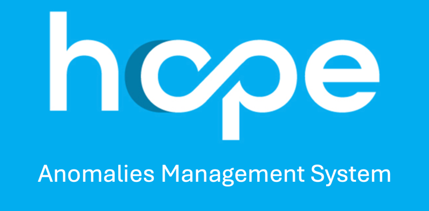
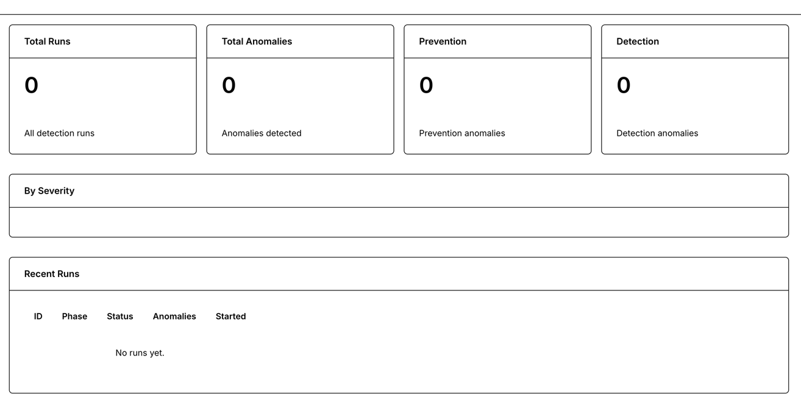

# Anomaly Management System (AMS)

---

Standalone Django service for rule-based anomaly detection on HOPE payment data.

📖 [Documentation](https://unicef.github.io/hope-ams) · [Contributing](CONTRIBUTING.md)

## Components

### Input

| Component | Description  	                                                  |
|-------|-----------------------------------------------------------------|
| Office| Represents UNICEF Country Office,equivalent of HOPE BusinesArea |
| Programme	 | Assistance Programme, same as in HOPE  	                        |
| PaymentPlan	 | Frozen/Serialized HOPE PaymentPlan  	                           |

### Engine

| Component    | Description  	                            |
|--------------|-------------------------------------------|
| Rule         | Logic used to analyse data                |
| RuleConfig	  | Rule configuration, thresholds etc.  	    |
| ProgramRuleConfiguration	 | Custom RuleConfig for specific Programme	 |

## Scope

Anomalies can be performed against PaymentPlan (and included Beneficiaries), or at Household (only) level. Each rule is designed to receive PaymentPlan or Household informations.

## Flows

AMS has two different flows, each pre (analyse) and post (detect) payment.

### Analyse

Analyse flow aims to detect anomalies BEFORE payment is executed to find data mismatch or anomalies in the beneficiary data

### Detect

Detect flow uses payment information to search for anomalies (es. amount mismatch, excessive amount ....)
