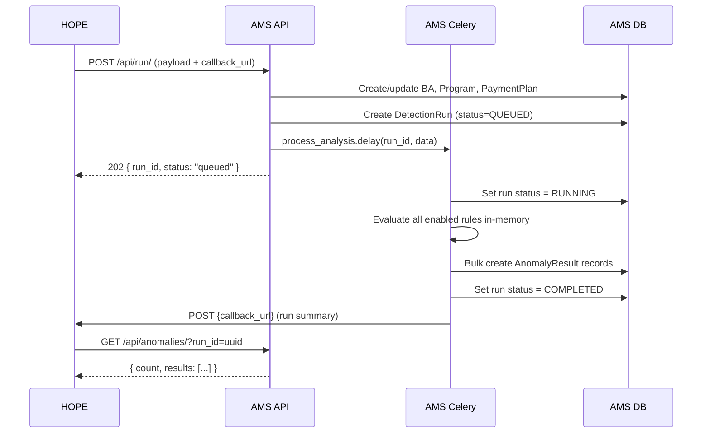

# Architecture

## Overview

AMS is a standalone Django microservice that performs rule-based anomaly detection on HOPE payment data. It has zero access to HOPE databases — all data is pushed via API.

## System flow

## Two phases

| Phase | Trigger | Data | Purpose |
|--------|---------|------|---------|
| **Prevention** | PaymentPlan → OPEN/LOCKED/ACCEPTED | Payments (Pending) + `snapshot_data` (frozen HH + individuals) | Catch issues before money is sent |
| **Detection** | PaymentPlan → FINISHED | Same + delivered quantities + verification results | Detect fraud/errors after reconciliation |

## Key decisions

- **No read-only replica** — AMS gets all data via API payload
- **Callback pattern** — AMS notifies HOPE when done; HOPE pulls results
- **Rule config hierarchy** — Global → BusinessArea → Program → PaymentPlan
- **Static API key auth** — simple shared secret in header
- **Advisory only** — AMS reports findings; HOPE decides what to do
- **Django templates** — no separate frontend build (admin dashboard only)
