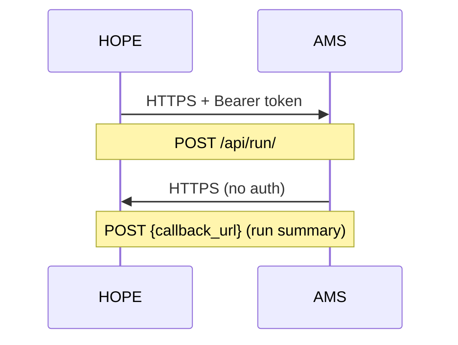

# Security

## API authentication

All API endpoints are protected with Bearer token authentication.

```http
Authorization: Bearer <HOPE_API_TOKEN>
```

The `HOPE_API_TOKEN` is configured via environment variable. There is no user model — the key is validated against the configured value.

## Network model



- HOPE → AMS: Authenticated with Bearer token
- AMS → HOPE: Callback to URL provided in payload (no additional auth)
- Both directions should be over HTTPS in production

## Recommendations

1. Store `HOPE_API_TOKEN` in a secure vault (e.g. Azure Key Vault, AWS Secrets Manager)
2. Use separate API keys per environment
3. Deploy AMS within the same virtual network as HOPE (or use HTTPS + firewall rules)
4. The callback URL should be a HOPE endpoint that validates the origin
5. Consider adding a shared secret for the callback direction if AMS is exposed externally

## Django security settings

| Setting | Default | Recommendation |
|---------|---------|----------------|
| `CSRF_COOKIE_SECURE` | `False` | `True` in production |
| `SESSION_COOKIE_SECURE` | `False` | `True` in production |
| `SECURE_HSTS_SECONDS` | 0 | 31536000 in production |
| `SECURE_SSL_REDIRECT` | `False` | `True` in production |
